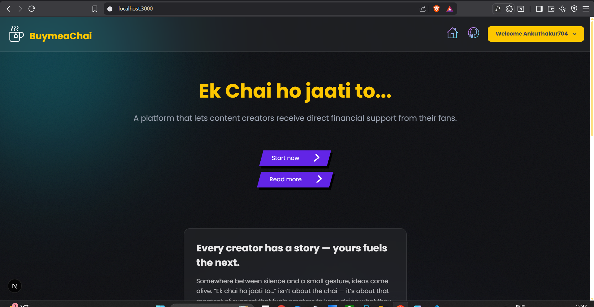

# ☕ GetMeAChai — Creator Support Platform

A full-stack creator support platform built with **Next.js App Router**, allowing creators to showcase their work and receive financial support from their audience.

Inspired by platforms like **Patreon**, this project focuses on real-world features such as payments, authentication, public creator pages, and engagement metrics.

---

### Home Page


---

## 🧠 Architecture (Important)

This is a **full-stack Next.js application**.

- **Frontend:** React (Next.js App Router)
- **Backend:** Next.js API Routes (`/app/api`)
- **Database:** MongoDB
- **Payments:** Razorpay

---

## 🚀 Features Implemented

### 🔐 Authentication
- User login system
- Creator-specific access and sessions

### 📊 Creator Dashboard
- Update creator profile information
- Manage public creator details
- View engagement-related data

### 💸 Payments (Razorpay)
- Supporters can make payments to creators
- Razorpay checkout integration
- Payment handling via API routes

### 🏆 Supporters’ Leaderboard
- Public leaderboard displaying top supporters
- Encourages engagement and repeat support

### 🖼️ Profile Customization
- Update profile image
- Update cover image
- Public-facing creator profile pages

---

## 🧩 Feature in Progress

### 🎨 Creator Sample Works (WIP)

**Creators can:**
- Add sample works to their profile
- Add descriptions for each work

**Viewers can:**
- View creator sample works
- Like individual works

**Purpose:**
- Showcase creator quality
- Build trust with supporters
- Increase engagement

---

## 🛠 Local Installation

Follow these steps to run the project on your local machine.

---

### Prerequisites

Make sure you have the following installed:

- **Node.js** (v18 or later)
- **npm**
- **MongoDB** (local instance or MongoDB Atlas)
- **Razorpay account** (for payment keys)

---

🛠 Local Installation

Follow these steps to run the project on your local machine.

Prerequisites

Make sure you have the following installed:

Node.js (v18 or later)

npm

MongoDB (local instance or MongoDB Atlas)

Razorpay account (for payment keys)

1️⃣ Clone the Repository
git clone https://github.com/AnkuThakur704/getmeachai.git
cd getmeachai

2️⃣ Install Dependencies
npm install

3️⃣ Configure Environment Variables

Create a .env.local file in the root directory and add:

MONGODB_URI=your_mongodb_connection_string

RAZORPAY_KEY_ID=your_razorpay_key_id
RAZORPAY_KEY_SECRET=your_razorpay_secret

NEXT_PUBLIC_APP_URL=http://localhost:3000

4️⃣ Run the Development Server
npm run dev

5️⃣ Open in Browser

Visit:

http://localhost:3000


## 📁 Project Structure

```text
/
├── actions/
│   └── useractions.js       # Server actions / business logic
│
├── app/
│   ├── api/                 # Backend API routes
│   ├── db/                  # Database connection
│   ├── models/              # MongoDB models
│   ├── dashboard/           # Creator dashboard pages
│   ├── login/               # Authentication pages
│   ├── [username]/          # Public creator profile pages
│   ├── components/          # App-specific components
│   ├── layout.js            # Root layout
│   └── page.js              # Landing page
│
├── lib/
│   └── utils.js             # Utility functions
│
├── public/                  # Static assets
├── next.config.mjs
├── package.json
└── README.md


